# Policies

Her dokumenteres primært hvordan de ulike policiene (regelsettene) er implementert, visuelt vha. flytdiagrammer.

## Oversikt over policies

* [EksternBrukerTilgangTilEksternBrukerPolicy](#eksternbrukertilgangtileksternbrukerpolicy)
* [NavAnsattBehandleFortroligBrukerePolicy](#navansattbehandlefortroligbrukerepolicy)
* [NavAnsattBehandleSkjermedePersonerPolicy](#navansattbehandleskjermedepersonerpolicy)
* [NavAnsattBehandleStrengtFortroligBrukerePolicy](#navansattbehandlestrengtfortroligbrukerepolicy)
* [NavAnsattBehandleStrengtFortroligUtlandBrukerePolicy](#navansattbehandlestrengtfortroligutlandbrukerepolicy)
* [NavAnsattTilgangTilAdressebeskyttetBrukerPolicy](#navansatttilgangtiladressebeskyttetbrukerpolicy)
* [NavAnsattTilgangTilEksternBrukerPolicy](#navansatttilgangtileksternbrukerpolicy)
* [NavAnsattTilgangTilEksternBrukerNavEnhetPolicy](#navansatttilgangtileksternbrukernavenhetpolicy)
* [NavAnsattTilgangTilModiaPolicy](#navansatttilgangtilmodiapolicy)
* [NavAnsattTilgangTilModiaAdminPolicy](#navansatttilgangtilmodiaadminpolicy)
* [NavAnsattTilgangTilModiaGenerellPolicy](#navansatttilgangtilmodiagenerellpolicy)
* [NavAnsattTilgangTilNavEnhetPolicy](#navansatttilgangtilnavenhetpolicy)
* [NavAnsattTilgangTilNavEnhetMedSperrePolicy](#navansatttilgangtilnavenhetmedsperrepolicy)
* [NavAnsattTilgangTilOppfolgingPolicy](#navansatttilgangtiloppfolgingpolicy)
* [NavAnsattTilgangTilSkjermetPersonPolicy](#navansatttilgangtilskjermetpersonpolicy)
* [NavAnsattUtenModiarolleTilgangTilEksternBrukerPolicy](#navansattutenmodiarolletilgangtileksternbrukerpolicy)

## Policies og avhengigheter til andre policies

Noen policier har avhengigheter til/bruker andre policier som en del av regelsettet sitt. Dette kan visualiseres slik:

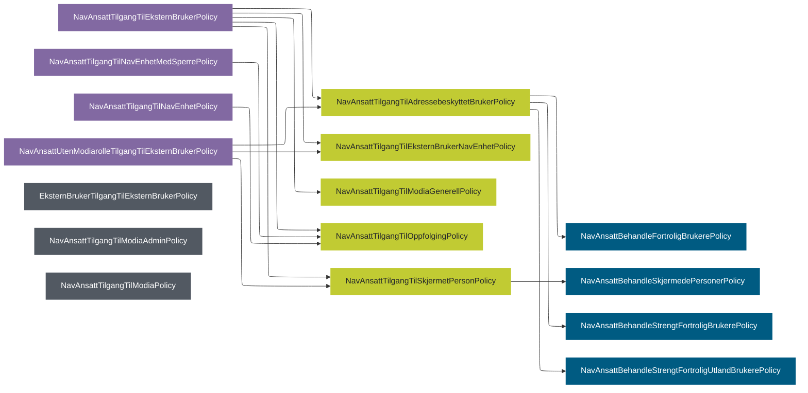
```mermaid
---
config:
    layout: elk
---
graph LR
    %% Nivå 1
    NavAnsattTilgangTilEksternBrukerPolicy
    NavAnsattTilgangTilNavEnhetMedSperrePolicy
    NavAnsattTilgangTilNavEnhetPolicy
    NavAnsattUtenModiarolleTilgangTilEksternBrukerPolicy
    
    %% Nivå 1 standalone
    EksternBrukerTilgangTilEksternBrukerPolicy
    NavAnsattTilgangTilModiaAdminPolicy
    NavAnsattTilgangTilModiaPolicy
    
    %% Nivå 2
    NavAnsattTilgangTilAdressebeskyttetBrukerPolicy
    NavAnsattTilgangTilEksternBrukerNavEnhetPolicy
    NavAnsattTilgangTilModiaGenerellPolicy
    NavAnsattTilgangTilOppfolgingPolicy
    NavAnsattTilgangTilSkjermetPersonPolicy
    
    %% Nivå 3
    NavAnsattBehandleFortroligBrukerePolicy
    NavAnsattBehandleSkjermedePersonerPolicy
    NavAnsattBehandleStrengtFortroligBrukerePolicy
    NavAnsattBehandleStrengtFortroligUtlandBrukerePolicy
    
    %% Nivå 1 --> nivå 2
    NavAnsattTilgangTilEksternBrukerPolicy --> NavAnsattTilgangTilModiaGenerellPolicy
    NavAnsattTilgangTilEksternBrukerPolicy --> NavAnsattTilgangTilAdressebeskyttetBrukerPolicy
    NavAnsattTilgangTilEksternBrukerPolicy --> NavAnsattTilgangTilEksternBrukerNavEnhetPolicy
    NavAnsattTilgangTilEksternBrukerPolicy --> NavAnsattTilgangTilSkjermetPersonPolicy
    NavAnsattTilgangTilEksternBrukerPolicy --> NavAnsattTilgangTilOppfolgingPolicy
    NavAnsattTilgangTilNavEnhetMedSperrePolicy --> NavAnsattTilgangTilOppfolgingPolicy
    NavAnsattTilgangTilNavEnhetPolicy --> NavAnsattTilgangTilOppfolgingPolicy
    NavAnsattUtenModiarolleTilgangTilEksternBrukerPolicy --> NavAnsattTilgangTilAdressebeskyttetBrukerPolicy
    NavAnsattUtenModiarolleTilgangTilEksternBrukerPolicy --> NavAnsattTilgangTilEksternBrukerNavEnhetPolicy
    NavAnsattUtenModiarolleTilgangTilEksternBrukerPolicy --> NavAnsattTilgangTilSkjermetPersonPolicy
    
    %% Nivå 2 --> nivå 3
    NavAnsattTilgangTilAdressebeskyttetBrukerPolicy --> NavAnsattBehandleFortroligBrukerePolicy
    NavAnsattTilgangTilAdressebeskyttetBrukerPolicy --> NavAnsattBehandleStrengtFortroligBrukerePolicy
    NavAnsattTilgangTilAdressebeskyttetBrukerPolicy --> NavAnsattBehandleStrengtFortroligUtlandBrukerePolicy
    NavAnsattTilgangTilSkjermetPersonPolicy --> NavAnsattBehandleSkjermedePersonerPolicy
    
    %% Styling
    classDef niva1 fill:#8269A2,stroke:none,color:#FFFFFF
    classDef niva2 fill:#C1CB33,stroke:none,color:#23262A
    classDef niva3 fill:#005B82,stroke:none,color:#FFFFFF
    classDef standalone fill:#525962,stroke:none,color:#FFFFFF
    
    class NavAnsattTilgangTilEksternBrukerPolicy,NavAnsattUtenModiarolleTilgangTilEksternBrukerPolicy,NavAnsattTilgangTilNavEnhetPolicy,NavAnsattTilgangTilNavEnhetMedSperrePolicy niva1;
    class NavAnsattTilgangTilAdressebeskyttetBrukerPolicy,NavAnsattTilgangTilSkjermetPersonPolicy,NavAnsattTilgangTilEksternBrukerNavEnhetPolicy,NavAnsattTilgangTilOppfolgingPolicy,NavAnsattTilgangTilModiaGenerellPolicy niva2;
    class NavAnsattBehandleFortroligBrukerePolicy,NavAnsattBehandleStrengtFortroligBrukerePolicy,NavAnsattBehandleStrengtFortroligUtlandBrukerePolicy,NavAnsattBehandleSkjermedePersonerPolicy niva3;
    class EksternBrukerTilgangTilEksternBrukerPolicy,NavAnsattTilgangTilModiaPolicy,NavAnsattTilgangTilModiaAdminPolicy standalone;
```

## Policies: flytdiagram

Flytdiagram som illustrerer regelsettet til hver enkelt policy.

### EksternBrukerTilgangTilEksternBrukerPolicy

**[Implementasjon](./impl/EksternBrukerTilgangTilEksternBrukerPolicyImpl.kt)**

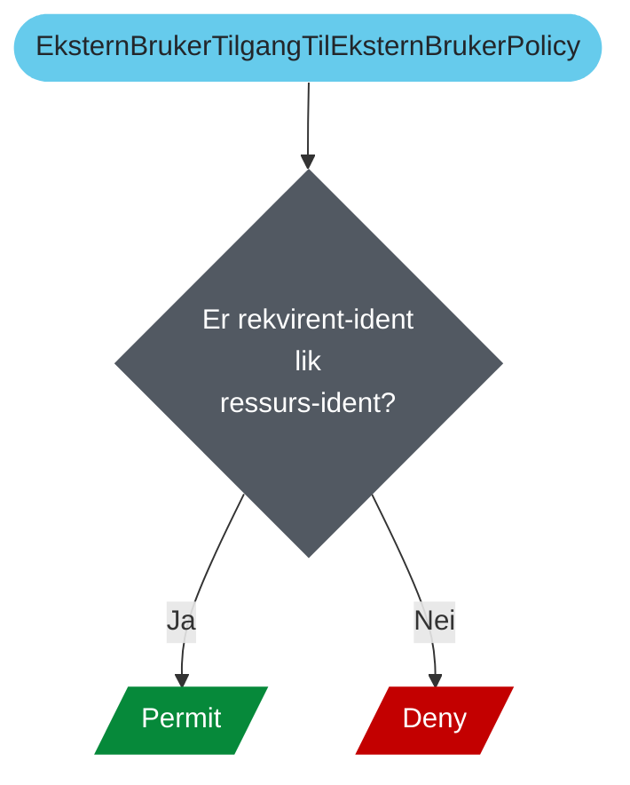
```mermaid
flowchart TD
    Start([EksternBrukerTilgangTilEksternBrukerPolicy])
    Check_1{Er rekvirent-ident <br> lik <br> ressurs-ident?}
    Permit[/Permit/]
    Deny[/Deny/]

    Start-->Check_1
    Check_1--Ja-->Permit
    Check_1--Nei-->Deny
    
    classDef success fill:#06893A,color:#FFFFFF,stroke:none
    classDef danger fill:#C30000,color:#FFFFFF,stroke:none
    classDef info fill:#66CBEC,color:#23262A,stroke:none
    classDef neutral fill:#525962,color:#FFFFFF,stroke:none
    class Start info
    class Permit success
    class Deny danger
    class Check_1 neutral
```

### NavAnsattBehandleFortroligBrukerePolicy

**[Implementasjon](./impl/NavAnsattBehandleFortroligBrukerePolicyImpl.kt)**

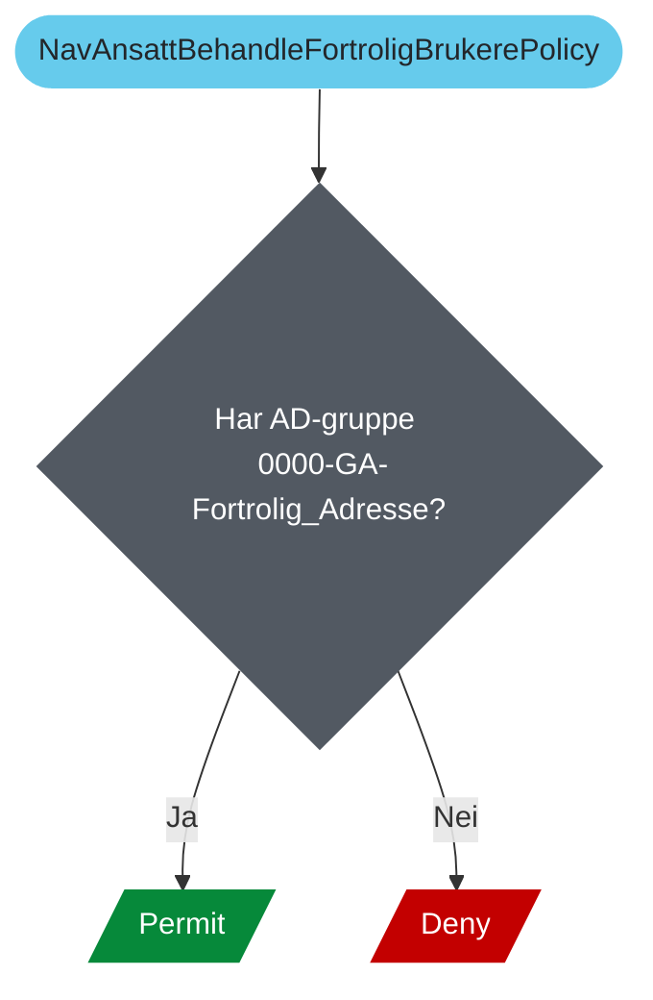
```mermaid
flowchart
    Start([NavAnsattBehandleFortroligBrukerePolicy])
    Check_1{Har AD-gruppe <br> 0000-GA-Fortrolig_Adresse?}
    Permit[/Permit/]
    Deny[/Deny/]
    
    Start-->Check_1
    Check_1--Ja-->Permit
    Check_1--Nei-->Deny

    classDef success fill:#06893A,color:#FFFFFF,stroke:none
    classDef danger fill:#C30000,color:#FFFFFF,stroke:none
    classDef info fill:#66CBEC,color:#23262A,stroke:none
    classDef neutral fill:#525962,color:#FFFFFF,stroke:none
    class Start info
    class Permit success
    class Deny danger
    class Check_1 neutral
```

### NavAnsattBehandleSkjermedePersonerPolicy

**[Implementasjon](./impl/NavAnsattBehandleSkjermedePersonerPolicyImpl.kt)**

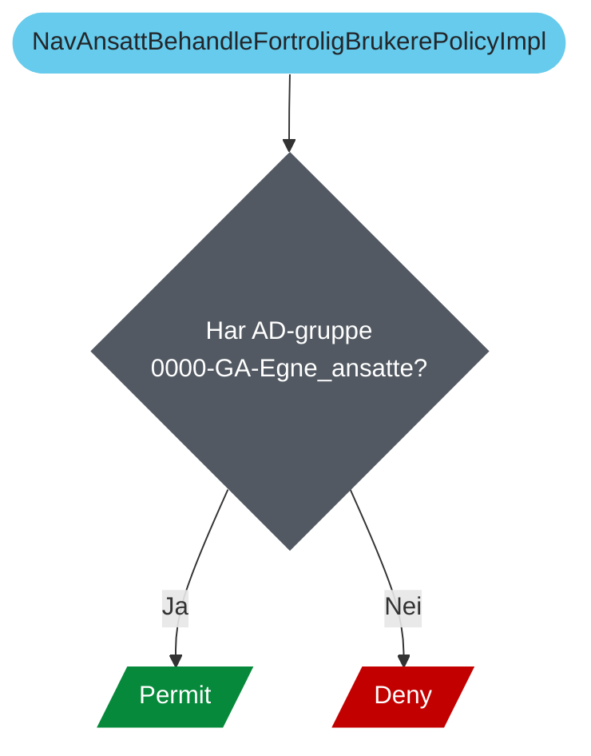
```mermaid
flowchart
    Start([NavAnsattBehandleFortroligBrukerePolicyImpl])
    Check_1{Har AD-gruppe <br> 0000-GA-Egne_ansatte?}
    Permit[/Permit/]
    Deny[/Deny/]
    
    Start-->Check_1
    Check_1--Ja-->Permit
    Check_1--Nei-->Deny

    classDef success fill:#06893A,color:#FFFFFF,stroke:none
    classDef danger fill:#C30000,color:#FFFFFF,stroke:none
    classDef info fill:#66CBEC,color:#23262A,stroke:none
    classDef neutral fill:#525962,color:#FFFFFF,stroke:none
    class Start info
    class Permit success
    class Deny danger
    class Check_1 neutral
```

### NavAnsattBehandleStrengtFortroligBrukerePolicy

**[Implementasjon](./impl/NavAnsattBehandleStrengtFortroligBrukerePolicyImpl.kt)**

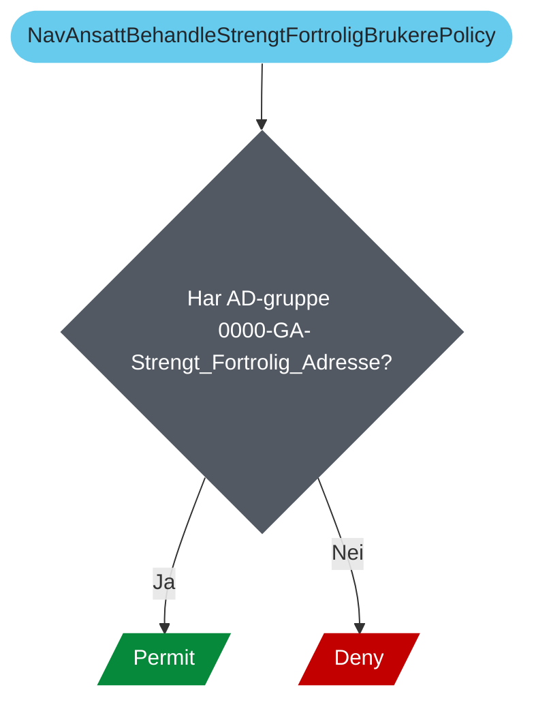
```mermaid
flowchart
    Start([NavAnsattBehandleStrengtFortroligBrukerePolicy])
    Check_1{Har AD-gruppe <br> 0000-GA-Strengt_Fortrolig_Adresse?}
    Permit[/Permit/]
    Deny[/Deny/]
    
    Start-->Check_1
    Check_1--Ja-->Permit
    Check_1--Nei-->Deny

    classDef success fill:#06893A,color:#FFFFFF,stroke:none
    classDef danger fill:#C30000,color:#FFFFFF,stroke:none
    classDef info fill:#66CBEC,color:#23262A,stroke:none
    classDef neutral fill:#525962,color:#FFFFFF,stroke:none
    class Start info
    class Permit success
    class Deny danger
    class Check_1 neutral
```

### NavAnsattBehandleStrengtFortroligUtlandBrukerePolicy

**[Implementasjon](./impl/NavAnsattBehandleStrengtFortroligUtlandBrukerePolicyImpl.kt)**

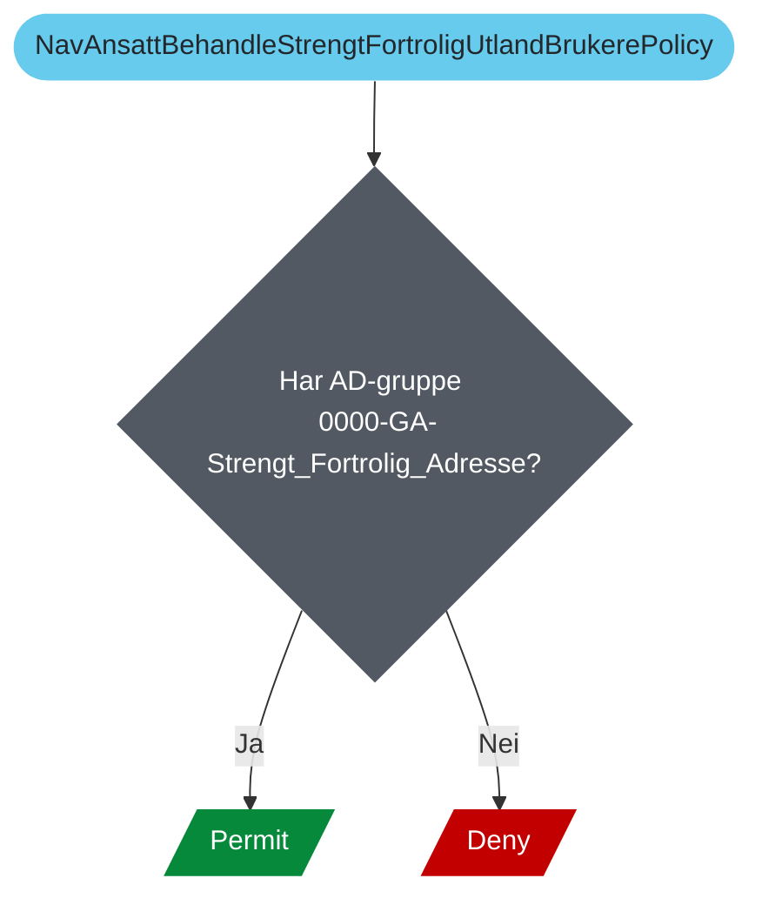
```mermaid
flowchart
    Start([NavAnsattBehandleStrengtFortroligUtlandBrukerePolicy])
    Check_1{Har AD-gruppe <br> 0000-GA-Strengt_Fortrolig_Adresse?}
    Permit[/Permit/]
    Deny[/Deny/]
    
    Start-->Check_1
    Check_1--Ja-->Permit
    Check_1--Nei-->Deny

    classDef success fill:#06893A,color:#FFFFFF,stroke:none
    classDef danger fill:#C30000,color:#FFFFFF,stroke:none
    classDef info fill:#66CBEC,color:#23262A,stroke:none
    classDef neutral fill:#525962,color:#FFFFFF,stroke:none
    class Start info
    class Permit success
    class Deny danger
    class Check_1 neutral
```

### NavAnsattTilgangTilAdressebeskyttetBrukerPolicy

**[Implementasjon](./impl/NavAnsattTilgangTilAdressebeskyttetBrukerPolicyImpl.kt)**

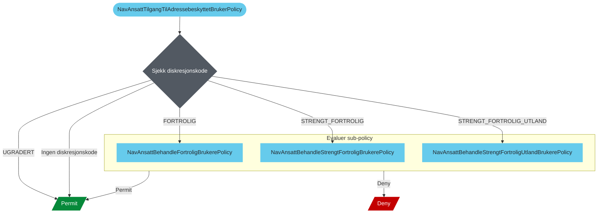
```mermaid
flowchart
    Start([NavAnsattTilgangTilAdressebeskyttetBrukerPolicy])
    Permit[/Permit/]
    Deny[/Deny/]
    Check_diskresjonskode{Sjekk diskresjonskode}
    
    Start-->Check_diskresjonskode
    Check_diskresjonskode--FORTROLIG-->Evaluate_NavAnsattBehandleFortroligBrukerePolicy
    Check_diskresjonskode--STRENGT_FORTROLIG-->Evaluate_NavAnsattBehandleStrengtFortroligBrukerePolicy
    Check_diskresjonskode--STRENGT_FORTROLIG_UTLAND-->Evaluate_NavAnsattBehandleStrengtFortroligUtlandBrukerePolicy
    Check_diskresjonskode--UGRADERT-->Permit
    Check_diskresjonskode--Ingen diskresjonskode-->Permit
    
    subgraph Velg_policy[Evaluer sub-policy]
        Evaluate_NavAnsattBehandleFortroligBrukerePolicy[NavAnsattBehandleFortroligBrukerePolicy]
        Evaluate_NavAnsattBehandleStrengtFortroligBrukerePolicy[NavAnsattBehandleStrengtFortroligBrukerePolicy]
        Evaluate_NavAnsattBehandleStrengtFortroligUtlandBrukerePolicy[NavAnsattBehandleStrengtFortroligUtlandBrukerePolicy]
    end

    Velg_policy--Permit-->Permit
    Velg_policy--Deny-->Deny

    classDef success fill:#06893A,color:#FFFFFF,stroke:none
    classDef danger fill:#C30000,color:#FFFFFF,stroke:none
    classDef info fill:#66CBEC,color:#23262A,stroke:none
    classDef neutral fill:#525962,color:#FFFFFF,stroke:none
    class Start info
    class Permit success
    class Deny danger
    class Input_diskresjonskode neutral
    class Check_diskresjonskode neutral
    class Check_strengt_fortrolig neutral
    class Check_strengt_fortrolig_utland neutral
    class Evaluate_NavAnsattBehandleFortroligBrukerePolicy info
    class Evaluate_NavAnsattBehandleStrengtFortroligBrukerePolicy info
    class Evaluate_NavAnsattBehandleStrengtFortroligUtlandBrukerePolicy info

    click Evaluate_NavAnsattBehandleFortroligBrukerePolicy "https://github.com/navikt/poao-tilgang/blob/main/core/src/main/kotlin/no/nav/poao_tilgang/core/policy/Policies.md#navansattbehandlefortroligbrukerepolicy"
    click Evaluate_NavAnsattBehandleStrengtFortroligBrukerePolicy "https://github.com/navikt/poao-tilgang/blob/main/core/src/main/kotlin/no/nav/poao_tilgang/core/policy/Policies.md#navansattbehandlestrengtfortroligbrukerepolicy"
    click Evaluate_NavAnsattBehandleStrengtFortroligUtlandBrukerePolicy "https://github.com/navikt/poao-tilgang/blob/main/core/src/main/kotlin/no/nav/poao_tilgang/core/policy/Policies.md#navansattbehandlestrengtfortroligutlandbrukerepolicy"
```

### NavAnsattTilgangTilEksternBrukerNavEnhetPolicy

**[Implementasjon](./impl/NavAnsattTilgangTilEksternBrukerNavEnhetPolicyImpl.kt)**

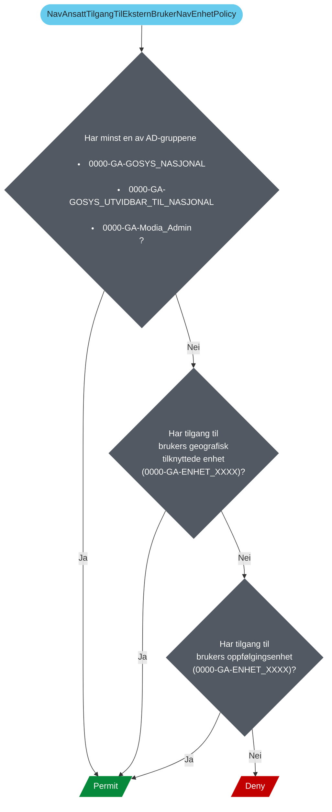
```mermaid
flowchart
    Start([NavAnsattTilgangTilEksternBrukerNavEnhetPolicy])
    Check_1{Har minst en av AD-gruppene <br> <li>0000-GA-GOSYS_NASJONAL</li> <li>0000-GA-GOSYS_UTVIDBAR_TIL_NASJONAL</li> <li>0000-GA-Modia_Admin</li>?}
    Check_2{"Har tilgang til <br> brukers geografisk <br> tilknyttede enhet <br> (0000-GA-ENHET_XXXX)?"}
    Check_3{"Har tilgang til <br> brukers oppfølgingsenhet <br> (0000-GA-ENHET_XXXX)?"}
    Permit[/Permit/]
    Deny[/Deny/]

    Start-->Check_1
    Check_1--Ja-->Permit
    Check_1--Nei-->Check_2
    Check_2--Ja-->Permit
    Check_2--Nei-->Check_3
    Check_3--Ja-->Permit
    Check_3--Nei-->Deny

    classDef success fill:#06893A,color:#FFFFFF,stroke:none
    classDef danger fill:#C30000,color:#FFFFFF,stroke:none
    classDef info fill:#66CBEC,color:#23262A,stroke:none
    classDef neutral fill:#525962,color:#FFFFFF,stroke:none
    class Start info
    class Permit success
    class Deny danger
    class Check_1 neutral
    class Check_2 neutral
    class Check_3 neutral
```

### NavAnsattTilgangTilEksternBrukerPolicy

**[Implementasjon](./impl/NavAnsattTilgangTilEksternBrukerPolicyImpl.kt)**

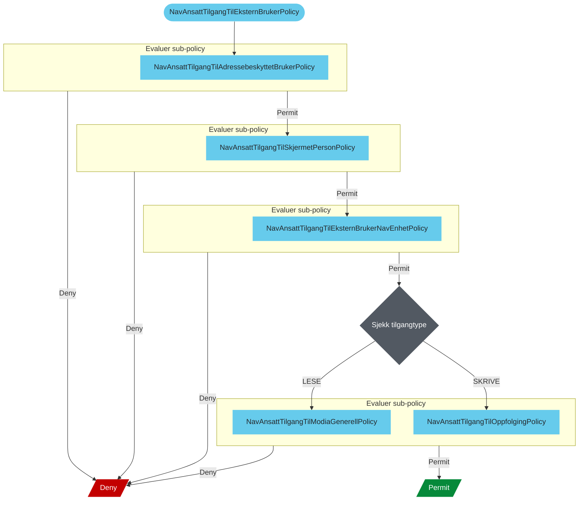
```mermaid
flowchart
    Start([NavAnsattTilgangTilEksternBrukerPolicy])
    Permit[/Permit/]
    Deny[/Deny/]
    Check_tilgangtype{Sjekk tilgangtype}
    
    Start-->NavAnsattTilgangTilAdressebeskyttetBrukerPolicy
    Evaluer_NavAnsattTilgangTilAdressebeskyttetBrukerPolicy--Deny-->Deny
    Evaluer_NavAnsattTilgangTilAdressebeskyttetBrukerPolicy--Permit-->NavAnsattTilgangTilSkjermetPersonPolicy
    Evaluer_NavAnsattTilgangTilSkjermetPersonPolicy--Deny-->Deny
    Evaluer_NavAnsattTilgangTilSkjermetPersonPolicy--Permit-->NavAnsattTilgangTilEksternBrukerNavEnhetPolicy
    Evaluer_NavAnsattTilgangTilEksternBrukerNavEnhetPolicy--Deny-->Deny
    Evaluer_NavAnsattTilgangTilEksternBrukerNavEnhetPolicy--Permit-->Check_tilgangtype
    Check_tilgangtype--LESE-->NavAnsattTilgangTilModiaGenerellPolicy
    Check_tilgangtype--SKRIVE-->NavAnsattTilgangTilOppfolgingPolicy
    Velg_policy--Deny-->Deny
    Velg_policy--Permit-->Permit
    
    subgraph Evaluer_NavAnsattTilgangTilAdressebeskyttetBrukerPolicy[Evaluer sub-policy]
        NavAnsattTilgangTilAdressebeskyttetBrukerPolicy[NavAnsattTilgangTilAdressebeskyttetBrukerPolicy]    
    end
    
    subgraph Evaluer_NavAnsattTilgangTilSkjermetPersonPolicy[Evaluer sub-policy]
        NavAnsattTilgangTilSkjermetPersonPolicy[NavAnsattTilgangTilSkjermetPersonPolicy]    
    end
    
    subgraph Evaluer_NavAnsattTilgangTilEksternBrukerNavEnhetPolicy[Evaluer sub-policy]
        NavAnsattTilgangTilEksternBrukerNavEnhetPolicy[NavAnsattTilgangTilEksternBrukerNavEnhetPolicy]    
    end
    
    subgraph Velg_policy[Evaluer sub-policy]
        NavAnsattTilgangTilModiaGenerellPolicy[NavAnsattTilgangTilModiaGenerellPolicy]    
        NavAnsattTilgangTilOppfolgingPolicy[NavAnsattTilgangTilOppfolgingPolicy]    
    end
    
    classDef success fill:#06893A,color:#FFFFFF,stroke:none
    classDef danger fill:#C30000,color:#FFFFFF,stroke:none
    classDef info fill:#66CBEC,color:#23262A,stroke:none
    classDef neutral fill:#525962,color:#FFFFFF,stroke:none
    class Start info
    class Permit success
    class Deny danger
    class NavAnsattTilgangTilAdressebeskyttetBrukerPolicy info
    class NavAnsattTilgangTilSkjermetPersonPolicy info
    class NavAnsattTilgangTilEksternBrukerNavEnhetPolicy info
    class NavAnsattTilgangTilModiaGenerellPolicy info
    class NavAnsattTilgangTilOppfolgingPolicy info
    class Check_tilgangtype neutral

    click NavAnsattTilgangTilAdressebeskyttetBrukerPolicy "https://github.com/navikt/poao-tilgang/blob/main/core/src/main/kotlin/no/nav/poao_tilgang/core/policy/Policies.md#navansatttilgangtiladressebeskyttetbrukerpolicy"
    click NavAnsattTilgangTilSkjermetPersonPolicy "https://github.com/navikt/poao-tilgang/blob/main/core/src/main/kotlin/no/nav/poao_tilgang/core/policy/Policies.md#navansatttilgangtilskjermetpersonpolicy"
    click NavAnsattTilgangTilEksternBrukerNavEnhetPolicy "https://github.com/navikt/poao-tilgang/blob/main/core/src/main/kotlin/no/nav/poao_tilgang/core/policy/Policies.md#navansatttilgangtileksternbrukernavenhetpolicy"
    click NavAnsattTilgangTilModiaGenerellPolicy "https://github.com/navikt/poao-tilgang/blob/main/core/src/main/kotlin/no/nav/poao_tilgang/core/policy/Policies.md#navansatttilgangtilmodiagenerellpolicy"
    click NavAnsattTilgangTilOppfolgingPolicy "https://github.com/navikt/poao-tilgang/blob/main/core/src/main/kotlin/no/nav/poao_tilgang/core/policy/Policies.md#navansatttilgangtiloppfolgingpolicy"
```

### NavAnsattTilgangTilModiaAdminPolicy

**[Implementasjon](./impl/NavAnsattTilgangTilModiaAdminPolicyImpl.kt)**

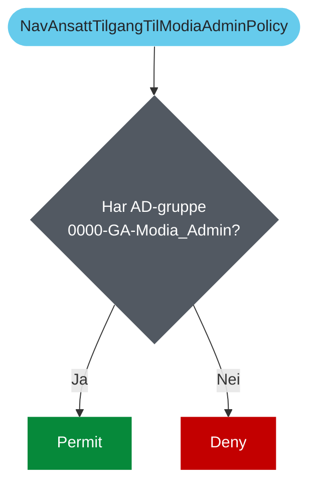
```mermaid
flowchart
    Start([NavAnsattTilgangTilModiaAdminPolicy])
    Check_1{Har AD-gruppe <br> 0000-GA-Modia_Admin?}
    
    Start-->Check_1
    Check_1--Ja-->Permit
    Check_1--Nei-->Deny

    classDef success fill:#06893A,color:#FFFFFF,stroke:none
    classDef danger fill:#C30000,color:#FFFFFF,stroke:none
    classDef info fill:#66CBEC,color:#23262A,stroke:none
    classDef neutral fill:#525962,color:#FFFFFF,stroke:none
    
    class Start info
    class Check_1 neutral
    class Permit success
    class Deny danger
```

### NavAnsattTilgangTilModiaGenerellPolicy

**[Implementasjon](./impl/NavAnsattTilgangTilModiaGenerellPolicyImpl.kt)**

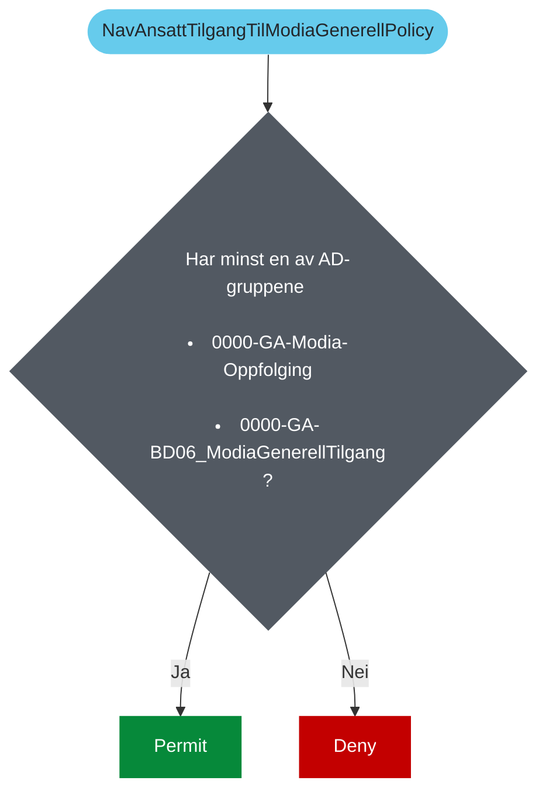
```mermaid
flowchart
    Start([NavAnsattTilgangTilModiaGenerellPolicy])
    Check_1{Har minst en av AD-gruppene <br> <li>0000-GA-Modia-Oppfolging</li> <li>0000-GA-BD06_ModiaGenerellTilgang</li>?}
    
    Start-->Check_1
    Check_1--Ja-->Permit
    Check_1--Nei-->Deny

    classDef success fill:#06893A,color:#FFFFFF,stroke:none
    classDef danger fill:#C30000,color:#FFFFFF,stroke:none
    classDef info fill:#66CBEC,color:#23262A,stroke:none
    classDef neutral fill:#525962,color:#FFFFFF,stroke:none
    
    class Start info
    class Check_1 neutral
    class Permit success
    class Deny danger
```

### NavAnsattTilgangTilModiaPolicy

**[Implementasjon](./impl/NavAnsattTilgangTilModiaPolicyImpl.kt)**

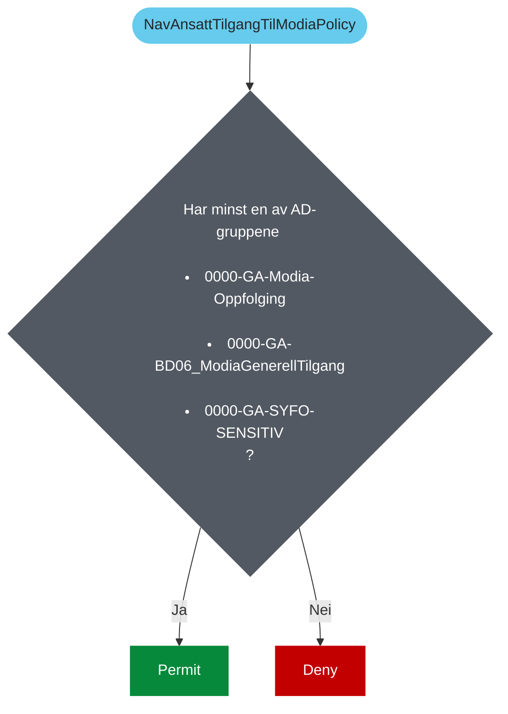
```mermaid
flowchart
    Start([NavAnsattTilgangTilModiaPolicy])
    Check_1{Har minst en av AD-gruppene <br> <li>0000-GA-Modia-Oppfolging</li> <li>0000-GA-BD06_ModiaGenerellTilgang</li> <li>0000-GA-SYFO-SENSITIV</li>?}
    
    Start-->Check_1
    Check_1--Ja-->Permit
    Check_1--Nei-->Deny

    classDef success fill:#06893A,color:#FFFFFF,stroke:none
    classDef danger fill:#C30000,color:#FFFFFF,stroke:none
    classDef info fill:#66CBEC,color:#23262A,stroke:none
    classDef neutral fill:#525962,color:#FFFFFF,stroke:none
    
    class Start info
    class Check_1 neutral
    class Permit success
    class Deny danger
```

### NavAnsattTilgangTilNavEnhetMedSperrePolicy

**[Implementasjon](./impl/NavAnsattTilgangTilNavEnhetMedSperrePolicyImpl.kt)**

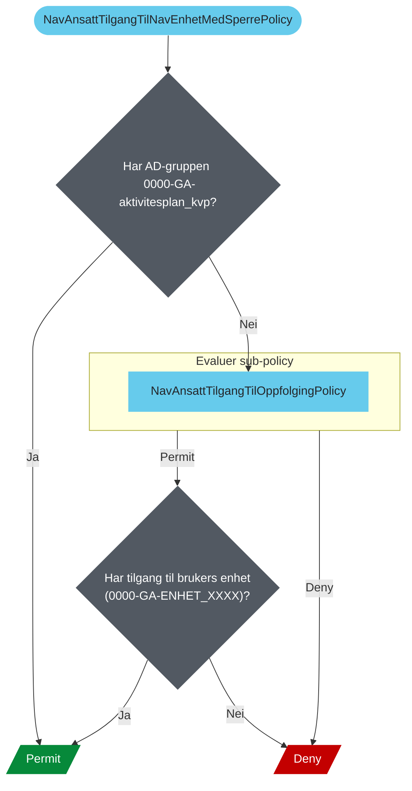
```mermaid
flowchart
    Start([NavAnsattTilgangTilNavEnhetMedSperrePolicy])
    Check_1{Har AD-gruppen <br> 0000-GA-aktivitesplan_kvp?}
    Check_2{"Har tilgang til brukers enhet <br> (0000-GA-ENHET_XXXX)?"}
    Permit[/Permit/]
    Deny[/Deny/]
    
    subgraph Evaluate_NavAnsattTilgangTilOppfolgingPolicy["Evaluer sub-policy"]
        NavAnsattTilgangTilOppfolgingPolicy["NavAnsattTilgangTilOppfolgingPolicy"]
    end
    
    Start-->Check_1
    Check_1--Ja-->Permit
    Check_1--Nei-->NavAnsattTilgangTilOppfolgingPolicy
    Evaluate_NavAnsattTilgangTilOppfolgingPolicy--Deny-->Deny
    Evaluate_NavAnsattTilgangTilOppfolgingPolicy--Permit-->Check_2
    Check_2--Nei-->Deny
    Check_2--Ja-->Permit

    classDef success fill:#06893A,color:#FFFFFF,stroke:none
    classDef danger fill:#C30000,color:#FFFFFF,stroke:none
    classDef info fill:#66CBEC,color:#23262A,stroke:none
    classDef neutral fill:#525962,color:#FFFFFF,stroke:none
    
    class Start info
    class Check_1 neutral
    class Check_2 neutral
    class Permit success
    class Deny danger
    class NavAnsattTilgangTilOppfolgingPolicy info
    
    click NavAnsattTilgangTilOppfolgingPolicy "https://github.com/navikt/poao-tilgang/blob/main/core/src/main/kotlin/no/nav/poao_tilgang/core/policy/Policies.md#navansatttilgangtiloppfolgingpolicy"
```
### NavAnsattTilgangTilNavEnhetPolicy

**[Implementasjon](./impl/NavAnsattTilgangTilNavEnhetPolicyImpl.kt)**

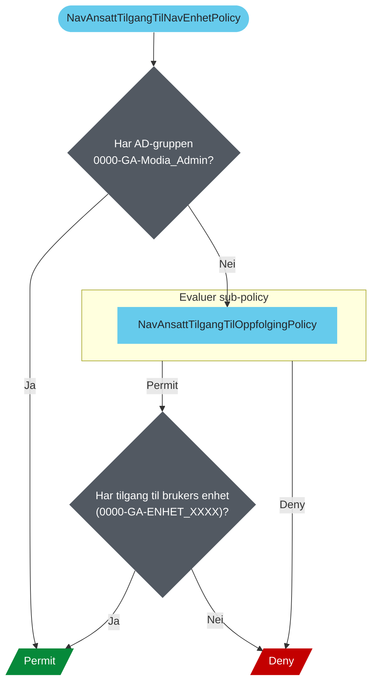
```mermaid
flowchart
    Start([NavAnsattTilgangTilNavEnhetPolicy])
    Permit[/Permit/]
    Deny[/Deny/]
    Check_1{Har AD-gruppen <br> 0000-GA-Modia_Admin?}
    Check_2{"Har tilgang til brukers enhet <br> (0000-GA-ENHET_XXXX)?"}
    
    Start-->Check_1
    Check_1--Ja-->Permit
    Check_1--Nei-->NavAnsattTilgangTilOppfolgingPolicy
    Evaluate_NavAnsattTilgangTilOppfolgingPolicy--Deny-->Deny
    Evaluate_NavAnsattTilgangTilOppfolgingPolicy--Permit-->Check_2
    Check_2--Nei-->Deny
    Check_2--Ja-->Permit
    
    
    subgraph Evaluate_NavAnsattTilgangTilOppfolgingPolicy[Evaluer sub-policy]
        NavAnsattTilgangTilOppfolgingPolicy["NavAnsattTilgangTilOppfolgingPolicy"]
    end

    classDef success fill:#06893A,color:#FFFFFF,stroke:none
    classDef danger fill:#C30000,color:#FFFFFF,stroke:none
    classDef info fill:#66CBEC,color:#23262A,stroke:none
    classDef neutral fill:#525962,color:#FFFFFF,stroke:none

    class Start info
    class Check_1 neutral
    class Check_2 neutral
    class Permit success
    class Deny danger
    class NavAnsattTilgangTilOppfolgingPolicy info
    
    click NavAnsattTilgangTilOppfolgingPolicy "https://github.com/navikt/poao-tilgang/blob/main/core/src/main/kotlin/no/nav/poao_tilgang/core/policy/Policies.md#navansatttilgangtiloppfolgingpolicy"
```

### NavAnsattTilgangTilOppfolgingPolicy

**[Implementasjon](./impl/NavAnsattTilgangTilOppfolgingPolicyImpl.kt)**

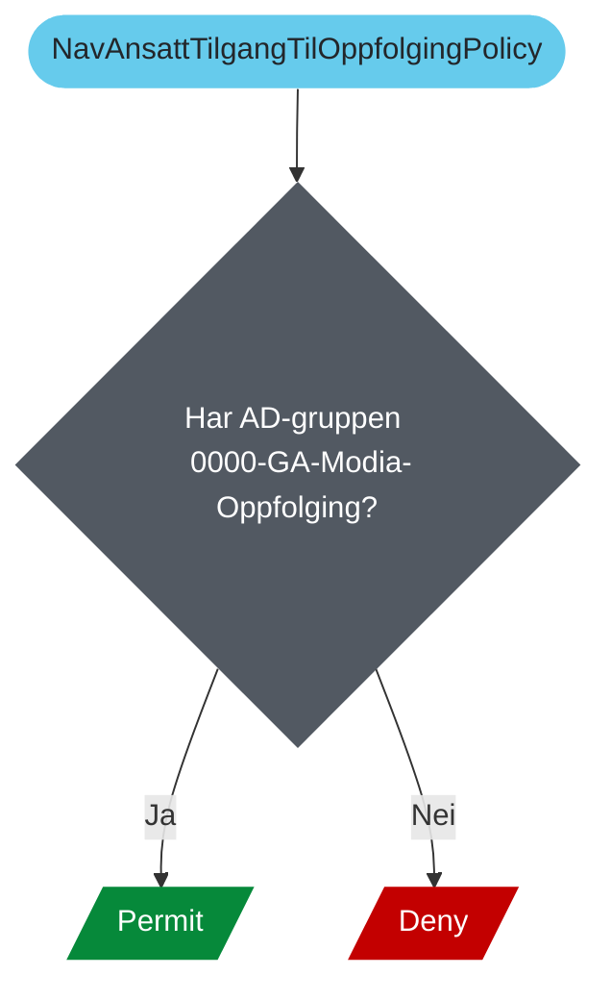
```mermaid
flowchart
    Start([NavAnsattTilgangTilOppfolgingPolicy])
    Check_1{Har AD-gruppen <br> 0000-GA-Modia-Oppfolging?}
    Permit[/Permit/]
    Deny[/Deny/]
    
    Start-->Check_1
    Check_1--Ja-->Permit
    Check_1--Nei-->Deny

    classDef success fill:#06893A,color:#FFFFFF,stroke:none
    classDef danger fill:#C30000,color:#FFFFFF,stroke:none
    classDef info fill:#66CBEC,color:#23262A,stroke:none
    classDef neutral fill:#525962,color:#FFFFFF,stroke:none

    class Start info
    class Check_1 neutral
    class Permit success
    class Deny danger
```

### NavAnsattTilgangTilSkjermetPersonPolicy

**[Implementasjon](./impl/NavAnsattTilgangTilSkjermetPersonPolicyImpl.kt)**

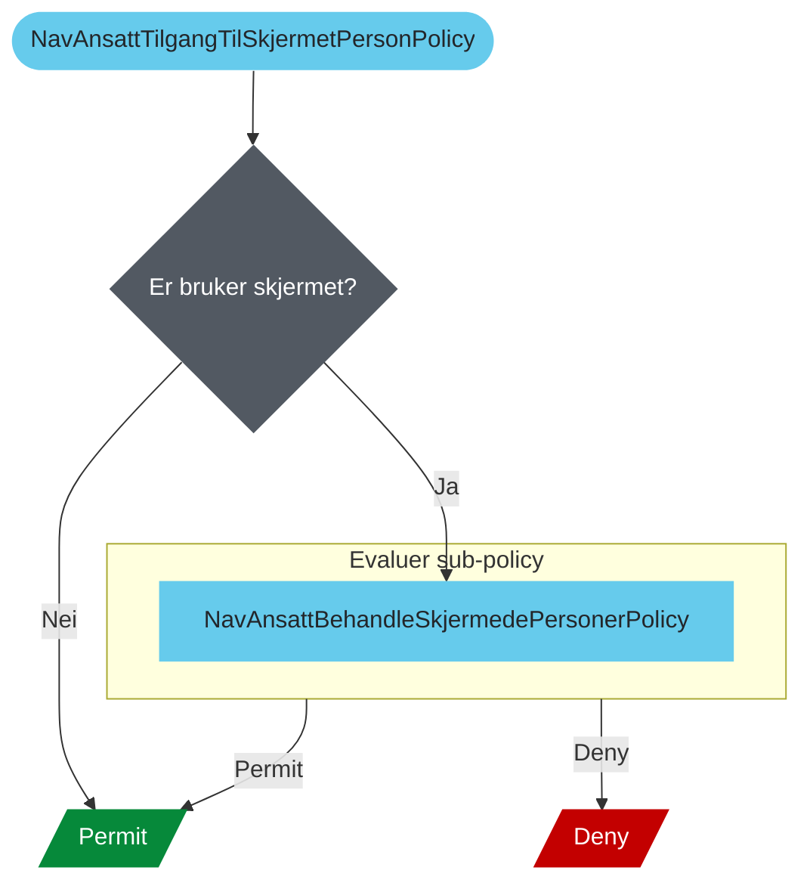
```mermaid
flowchart
    Start([NavAnsattTilgangTilSkjermetPersonPolicy])
    Check_1{Er bruker skjermet?}
    Permit[/Permit/]
    Deny[/Deny/]
    
    Start-->Check_1
    Check_1--Nei-->Permit
    Check_1--Ja-->NavAnsattBehandleSkjermedePersonerPolicy
    Evaluate_NavAnsattBehandleSkjermedePersonerPolicy--Deny-->Deny
    Evaluate_NavAnsattBehandleSkjermedePersonerPolicy--Permit-->Permit
    
    subgraph Evaluate_NavAnsattBehandleSkjermedePersonerPolicy[Evaluer sub-policy]
        NavAnsattBehandleSkjermedePersonerPolicy[NavAnsattBehandleSkjermedePersonerPolicy]
    end

    classDef success fill:#06893A,color:#FFFFFF,stroke:none
    classDef danger fill:#C30000,color:#FFFFFF,stroke:none
    classDef info fill:#66CBEC,color:#23262A,stroke:none
    classDef neutral fill:#525962,color:#FFFFFF,stroke:none

    class Start info
    class Check_1 neutral
    class Permit success
    class Deny danger
    class NavAnsattBehandleSkjermedePersonerPolicy info
    
    click NavAnsattBehandleSkjermedePersonerPolicy "https://github.com/navikt/poao-tilgang/blob/main/core/src/main/kotlin/no/nav/poao_tilgang/core/policy/Policies.md#navansattbehandleskjermedepersonerpolicy"
```

### NavAnsattUtenModiarolleTilgangTilEksternBrukerPolicy

**[Implementasjon](./impl/NavAnsattUtenModiarolleTilgangTilEksternBrukerPolicyImpl.kt)**

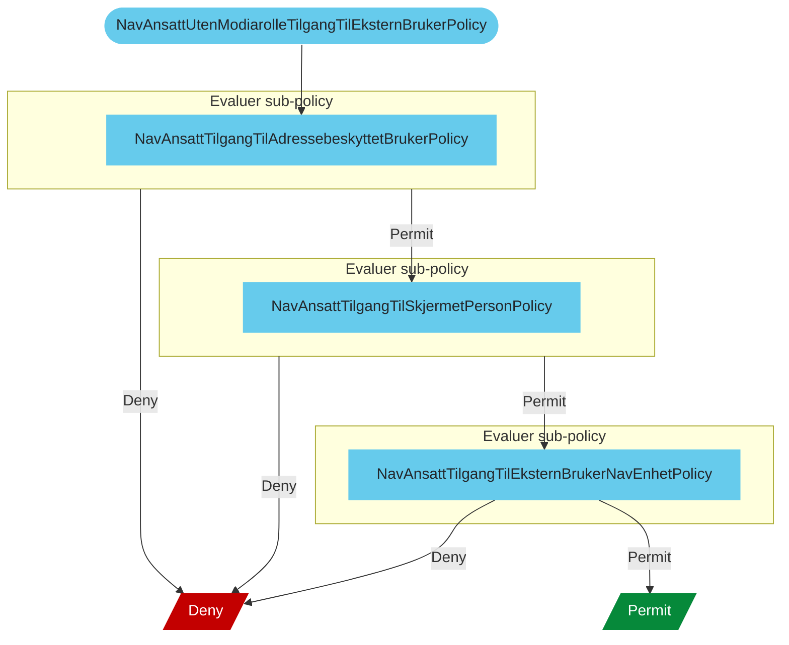
```mermaid
flowchart
    Start([NavAnsattUtenModiarolleTilgangTilEksternBrukerPolicy])
    Permit[/Permit/]
    Deny[/Deny/]
    Start-->NavAnsattTilgangTilAdressebeskyttetBrukerPolicy
    Evaluate_NavAnsattTilgangTilAdressebeskyttetBrukerPolicy--Deny-->Deny
    Evaluate_NavAnsattTilgangTilAdressebeskyttetBrukerPolicy--Permit-->NavAnsattTilgangTilSkjermetPersonPolicy
    Evaluate_NavAnsattTilgangTilSkjermetPersonPolicy--Deny-->Deny
    Evaluate_NavAnsattTilgangTilSkjermetPersonPolicy--Permit-->NavAnsattTilgangTilEksternBrukerNavEnhetPolicy
    NavAnsattTilgangTilEksternBrukerNavEnhetPolicy--Deny-->Deny
    NavAnsattTilgangTilEksternBrukerNavEnhetPolicy--Permit-->Permit

    subgraph Evaluate_NavAnsattTilgangTilAdressebeskyttetBrukerPolicy[Evaluer sub-policy]
        NavAnsattTilgangTilAdressebeskyttetBrukerPolicy
    end
    
    subgraph Evaluate_NavAnsattTilgangTilSkjermetPersonPolicy[Evaluer sub-policy]
        NavAnsattTilgangTilSkjermetPersonPolicy
    end
    
    subgraph Evaluate_NavAnsattTilgangTilEksternBrukerNavEnhetPolicy[Evaluer sub-policy]
        NavAnsattTilgangTilEksternBrukerNavEnhetPolicy
    end
    

    classDef success fill:#06893A,color:#FFFFFF,stroke:none
    classDef danger fill:#C30000,color:#FFFFFF,stroke:none
    classDef info fill:#66CBEC,color:#23262A,stroke:none
    classDef neutral fill:#525962,color:#FFFFFF,stroke:none

    class Start info
    class Check_1 neutral
    class Permit success
    class Deny danger
    class NavAnsattTilgangTilAdressebeskyttetBrukerPolicy info
    class NavAnsattTilgangTilSkjermetPersonPolicy info
    class NavAnsattTilgangTilEksternBrukerNavEnhetPolicy info

    click NavAnsattTilgangTilAdressebeskyttetBrukerPolicy "https://github.com/navikt/poao-tilgang/blob/main/core/src/main/kotlin/no/nav/poao_tilgang/core/policy/Policies.md#navansatttilgangtiladressebeskyttetbrukerpolicy"
    click NavAnsattTilgangTilSkjermetPersonPolicy "https://github.com/navikt/poao-tilgang/blob/main/core/src/main/kotlin/no/nav/poao_tilgang/core/policy/Policies.md#navansatttilgangtilskjermetpersonpolicy"
    click NavAnsattTilgangTilEksternBrukerNavEnhetPolicy "https://github.com/navikt/poao-tilgang/blob/main/core/src/main/kotlin/no/nav/poao_tilgang/core/policy/Policies.md#navansatttilgangtileksternbrukernavenhetpolicy"
```

